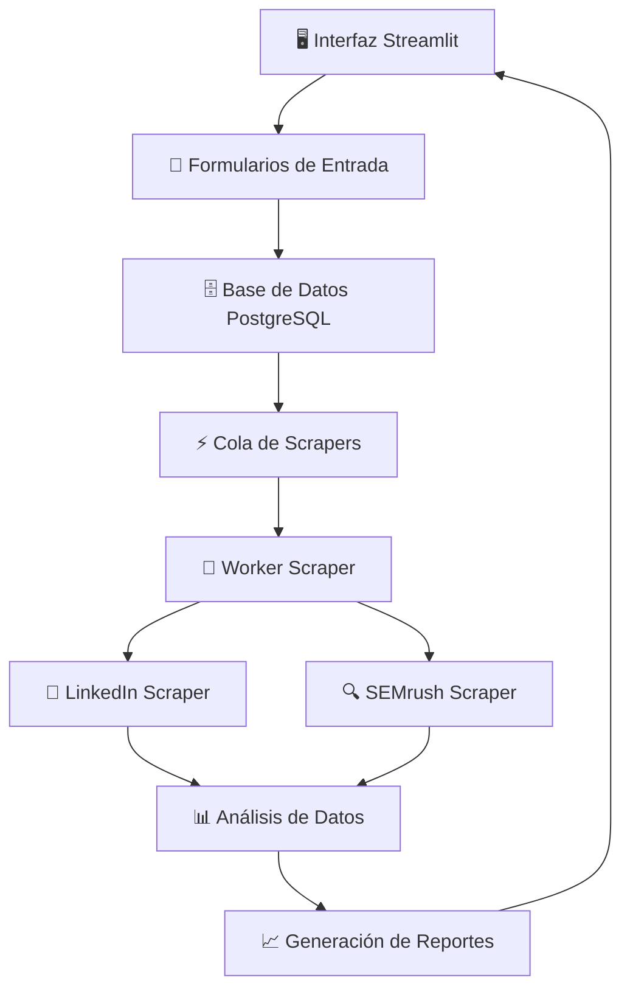

# 📊 Sistema de Análisis de Tendencias Académicas - UDLA

<div align="center">


*Sistema automatizado para análisis de viabilidad de programas académicos mediante web scraping y análisis de datos*

</div>

---

## 📋 Tabla de Contenidos

- [🎯 Descripción del Proyecto](#-descripción-del-proyecto)
- [🏗️ Arquitectura del Sistema](#️-arquitectura-del-sistema)
- [🚀 Características Principales](#-características-principales)
- [📦 Instalación](#-instalación)
- [⚙️ Configuración](#️-configuración)
- [🖥️ Uso del Sistema](#️-uso-del-sistema)
- [🤖 Sistema de Scrapers](#-sistema-de-scrapers)
- [📊 Módulos de Análisis](#-módulos-de-análisis)
- [🗄️ Base de Datos](#️-base-de-datos)
- [📈 Generación de Reportes](#-generación-de-reportes)
- [🔧 Troubleshooting](#-troubleshooting)
- [👥 Contribución](#-contribución)

---

## 🎯 Descripción del Proyecto

Este sistema automatizado está diseñado para **analizar la viabilidad de nuevos programas académicos** mediante la recopilación y análisis de datos de múltiples fuentes web. Utiliza técnicas de web scraping, análisis de datos y machine learning para proporcionar insights valiosos sobre tendencias educativas.

### 🌟 Objetivos Principales

- **📈 Análisis de Mercado**: Evaluar la demanda del mercado laboral
- **🔍 Investigación de Competencia**: Analizar programas similares existentes
- **📊 Tendencias de Búsqueda**: Monitorear interés público en áreas específicas
- **💼 Oportunidades Laborales**: Evaluar demanda profesional en LinkedIn

---

## 🏗️ Arquitectura del Sistema



### 🧩 Componentes Principales

| Componente              | Descripción               | Tecnología                           |
| ----------------------- | -------------------------- | ------------------------------------- |
| **Frontend**      | Interfaz web interactiva   | 🚀 Streamlit                          |
| **Backend**       | Lógica de negocio y API   | 🐍 Python                             |
| **Base de Datos** | Almacenamiento persistente | 🐘 PostgreSQL                         |
| **Scrapers**      | Automatización web        | 🌐 Selenium + Undetected ChromeDriver |
| **Análisis**     | Procesamiento de datos     | 📊 Pandas + NumPy                     |

---

## 🚀 Características Principales

### ✨ Funcionalidades Core

- **🎯 Gestión de Proyectos**: Crear, editar y eliminar proyectos de análisis
- **🤖 Scraping Automatizado**: Recopilación automática de datos web
- **📊 Análisis Multi-dimensional**: Evaluación desde 4 perspectivas clave
- **📈 Reportes Visuales**: Gráficos interactivos y presentaciones
- **⏰ Cola de Procesamiento**: Sistema de colas con prioridades
- **🔄 Monitoreo en Tiempo Real**: Estado de procesos en vivo

### 🛡️ Características Técnicas

- **🔒 Manejo de Sesiones**: Persistencia de sesiones de Chrome
- **🚫 Anti-detección**: Técnicas avanzadas para evitar bloqueos
- **📱 Responsive Design**: Interfaz adaptable a diferentes dispositivos
- **🔄 Reintentos Automáticos**: Manejo robusto de errores
- **📝 Logging Detallado**: Trazabilidad completa de procesos

---

## 📦 Instalación

### 📋 Requisitos del Sistema

- **🐍 Python**: 3.8 o superior
- **🐘 PostgreSQL**: 13 o superior
- **🌐 Google Chrome**: Última versión
- **💾 RAM**: Mínimo 8GB recomendado
- **💿 Espacio**: 5GB libres

### 🔧 Instalación Paso a Paso

1. **📥 Clonar el repositorio**

```bash
git clone https://github.com/tu-usuario/estudio-tendencia.git
cd estudio-tendencia
```

2. **🐍 Crear entorno virtual**

```bash
python -m venv venv
venv\Scripts\activate  # Windows
source venv/bin/activate  # Linux/Mac
```

3. **📦 Instalar dependencias**

```bash
pip install -r requirements.txt
```

4. **🗄️ Configurar base de datos**

```bash
# Crear base de datos en PostgreSQL
createdb estudio_tendencias
```

5. **📄 Ejecutar scripts SQL**

```bash
psql -d estudio_tendencias -f database/schema.sql
```

---

## ⚙️ Configuración

### 🔐 Variables de Entorno

Crear archivo `.env` en la raíz del proyecto:

```env
# 🗄️ Base de Datos
DB_HOST=localhost
DB_PORT=5432
DB_NAME=estudio_tendencias
DB_USER=tu_usuario
DB_PASSWORD=tu_password

# 🔗 LinkedIn
LINKEDIN_USER=tu_email@example.com
LINKEDIN_PASS=tu_password

# 🔍 SEMrush
SEMRUSH_USER=tu_email@example.com
SEMRUSH_PASS=tu_password

# ⚡ Worker Configuration
WORKER_POLL_SECONDS=5
```

### 🛠️ Configuración de Chrome

El sistema utiliza un perfil de Chrome personalizado ubicado en:

```
C:\Users\User\Documents\TRABAJO - UDLA\Estudio-Tendencia\profile
```

---

## 🖥️ Uso del Sistema

### 🚀 Iniciar la Aplicación

```bash
streamlit run app.py
```

La aplicación estará disponible en: `http://localhost:8501`

### 📝 Flujo de Trabajo

#### 1. **📋 Crear Proyecto**

- Acceder a la sección "Formulario"
- Completar datos del proyecto:
  - 📁 Tipo de carpeta (Pregrado/Posgrado)
  - 🎯 Carrera de referencia
  - 📚 Carrera de estudio
  - 🔍 Palabra clave SEMrush
  - 📊 Código CIIU
  - 📈 Tendencias de Google

#### 2. **⚡ Procesamiento Automático**

- El sistema encola automáticamente el proyecto
- Los scrapers procesan la información
- Se puede monitorear el estado en tiempo real

#### 3. **📊 Análisis de Resultados**

- Ver tabla de evaluación
- Generar reportes visuales
- Exportar presentaciones

---

## 🤖 Sistema de Scrapers

### 🔄 Worker Principal (`worker_scraper.py`)

El worker principal coordina todo el proceso de scraping:

```python
# 🧹 Limpieza de perfil por proyecto
# 🔗 Ejecución de LinkedIn scraper
# 🔍 Ejecución de SEMrush scraper
# 📊 Manejo de errores y reintentos
```

### 🔗 LinkedIn Scraper

**Funcionalidades:**

- 🔐 Login automático
- 📁 Navegación por carpetas
- 📊 Extracción de datos de reportes
- 🌍 Análisis por regiones (Ecuador, América Latina)

**Datos extraídos:**

- 👥 Número de profesionales
- 💼 Anuncios de empleo
- 📈 Porcentaje de demanda

### 🔍 SEMrush Scraper

**Funcionalidades:**

- 🔐 Login automático
- 🔍 Búsqueda de palabras clave
- 📊 Extracción de métricas SEO

**Datos extraídos:**

- 👁️ Visión general de búsquedas
- 🔤 Número de palabras clave
- 📊 Volumen de búsqueda

---

## 📊 Módulos de Análisis

### 🔍 Búsqueda Web (35%)

Combina datos de **SEMrush** y **Google Trends**:

```python
# 📈 SEMrush: 15% del total
# 📊 Google Trends: 20% del total
# 🎯 Resultado: Interés de búsqueda web
```

### 🔗 LinkedIn (25%)

Analiza demanda profesional:

```python
# 👥 Profesionales registrados
# 💼 Anuncios de empleo activos
# 📈 Ratio de demanda/oferta
```

### 🏢 Competencia (25%)

Evalúa programas similares:

```python
# 🎓 Modalidad presencial
# 💻 Modalidad virtual
# 📊 Análisis comparativo
```

### 💰 Mercado (15%)

Análisis económico sectorial:

```python
# 💼 Ingresos totales del sector
# 📈 Ventas anuales
# 🎯 Códigos CIIU específicos
```

---

## 🗄️ Base de Datos

### 📋 Tablas Principales

| Tabla                    | Descripción             | Campos Clave                                  |
| ------------------------ | ------------------------ | --------------------------------------------- |
| `proyectos_tendencias` | 📊 Proyectos principales | `id`, `carrera_estudio`, `tipo_carpeta` |
| `linkedin`             | 🔗 Datos de LinkedIn     | `profesionales`, `anuncios_empleo`        |
| `semrush`              | 🔍 Datos de SEMrush      | `vision_general`, `palabras`, `volumen` |
| `tendencias`           | 📈 Google Trends         | `palabra`, `promedio`                     |
| `scraper_queue`        | ⚡ Cola de procesamiento | `status`, `priority`, `proyecto_id`     |

### 🔄 Estados de Procesamiento

| Estado        | Descripción | Icono |
| ------------- | ------------ | ----- |
| `queued`    | En cola      | ⏳    |
| `running`   | Procesando   | 🟡    |
| `completed` | Completado   | 🟢    |
| `failed`    | Error        | 🔴    |

---

## 📈 Generación de Reportes

### 📊 Tabla de Evaluación

Muestra resultados por modalidad:

- **📏 Distribución**: Pesos de cada factor
- **🎓 Presencialidad**: Resultados modalidad presencial
- **💻 Virtualidad**: Resultados modalidad virtual
- **🎯 Total**: Puntuación final

### 📋 Rangos de Evaluación

| Rango      | Evaluación              | Color |
| ---------- | ------------------------ | ----- |
| 0% - 60%   | ❌ No Viable             | 🔴    |
| 61% - 70%  | ⚠️ Revisión Adicional | 🟡    |
| 71% - 100% | ✅ Viable                | 🟢    |

### 📊 Reportes Visuales

- **📈 Gráficos de radar**: Comparación multi-dimensional
- **📋 Tablas dinámicas**: Datos detallados
- **🎨 Presentaciones**: Formato exportable

---

## 🔧 Troubleshooting

### ❓ Problemas Comunes

#### 🌐 Error de Conexión a Sitios Web

**Síntomas**: Timeout o bloqueo de acceso
**Solución**:

```bash
# 🧹 Limpiar perfil de Chrome
python -c "from scrapers.linkedin_modules.driver_config import limpiar_perfil_completo; limpiar_perfil_completo('profile', 'Default')"
```

#### 🗄️ Error de Base de Datos

**Síntomas**: "Connection refused" o errores SQL
**Solución**:

```bash
# ✅ Verificar conexión
pg_isready -h localhost -p 5432
# 🔄 Reiniciar servicio PostgreSQL
```

#### 🤖 Scraper Atascado

**Síntomas**: Estado "running" por más de 10 minutos
**Solución**:

- El sistema automáticamente reintenta trabajos atascados
- Verificar logs del worker para más detalles

### 📝 Logs y Debugging

```bash
# 👀 Ver logs del worker
python worker_scraper.py

# 🔍 Ejecutar scraper individual
python scrapers/linkedin.py [proyecto_id]
python scrapers/semrush.py [proyecto_id]
```

---

## 🛠️ Desarrollo y Mantenimiento

### 🏗️ Estructura del Proyecto

```
📁 Estudio-Tendencia/
├── 📄 app.py                     # Aplicación principal Streamlit
├── 🤖 worker_scraper.py          # Worker de scrapers
├── 📁 scrapers/                  # Módulos de scraping
│   ├── 🔗 linkedin.py
│   ├── 🔍 semrush.py
│   └── 📁 linkedin_modules/      # Módulos LinkedIn
├── 📁 data_process/              # Módulos de análisis
│   ├── 🔍 busquedaWeb.py
│   ├── 🔗 linkedin.py
│   ├── 💰 mercado.py
│   └── 🏢 competencia.py
├── 📁 forms/                     # Formularios web
├── 📁 pages/                     # Páginas de la aplicación
└── 📁 profile/                   # Perfil de Chrome
```

### 🧪 Testing

```bash
# 🧪 Ejecutar tests unitarios
python -m pytest tests/

# 🔍 Test de scraper específico
python tests/test_linkedin.py
```

---

## 👥 Contribución

### 🤝 Cómo Contribuir

1. 🍴 Fork del repositorio
2. 🌿 Crear rama feature (`git checkout -b feature/nueva-funcionalidad`)
3. 💾 Commit cambios (`git commit -am 'Agregar nueva funcionalidad'`)
4. 📤 Push a la rama (`git push origin feature/nueva-funcionalidad`)
5. 🔀 Crear Pull Request

### 📋 Estándares de Código

- **🐍 PEP 8**: Seguir estándares de Python
- **📝 Documentación**: Comentarios claros y docstrings
- **🧪 Testing**: Incluir tests para nuevas funcionalidades
- **🔧 Logging**: Usar logging apropiado para debugging

---

## 😊Soporte

Para soporte técnico o preguntas:

- 📚 **Documentación**: Ver sección de troubleshooting
- 🐛 **Reportar bugs**: Crear issue en el repositorio

---

<div align="center">

**🎓 Desarrollado para Universidad de las Américas (UDLA)**

*Sistema de Análisis de Tendencias Académicas*


</div>
